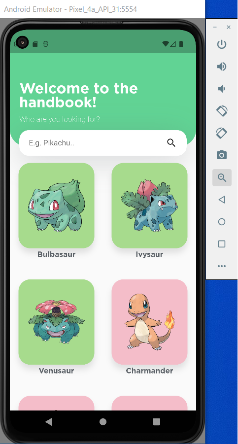
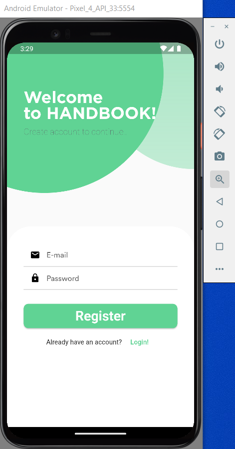
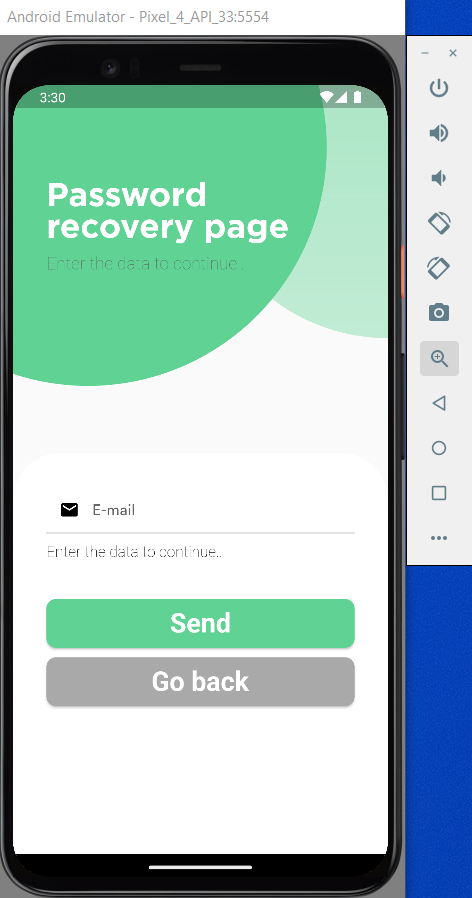

# TESTTASK-POKEMON.

This application is as a project on a summer internship from the university, after which — can be applied for an internship program (if, of course, the project and my knowledge to date like). Still, I would like to enroll in an internship program, where I can learn and gain new knowledge from experienced developers, as well as experience in mobile application development. 
I am aware of the responsibility and the fact that I will have to learn a lot and it will take a lot of time.

## That about the project (company requirements). 

Instructions:
- Create a simple application to view pokemons.

Minimal functionality:
- List should display pokemon names from REST APi. List should support pagination.
- When a user clicks on cell, then the details screen is opened.
- The Pokemon details page will use the REST API, and show the next information:
  - The Pokemon's name;
  - A single image of the pokemon from the front;
  - The Pokemon's "types" e.g. grass;
  - The Pokemon's weight in kg;
  - The Pokemon's height in cm;
  - The page should also have some form of back button to go back to the list.
- Make sure you consider and handle all possible states of the app (offline, data not loading, errors, etc).
- Data should be cached in the database to support offline mode.

Requirements:
- Clean Architecture.
- Use your own design for the application.
- Code should support Unit-testing.

Result:
- Code should be pushed to a public repository on GitHub.
- Repository should contains commit history instead of a single one.
- Select icons by yourself. App should contain non-default launch icon.
- Link should be provided to interviewer.

## Application Preview.

<!-- <table>
  <tr>
    <td><td>
  </tr>
</table> -->
<table>
  <tr>
    <th>Home Page</th>
    <th>Detail</th>
    <th>Search</th>
  </tr>
  <tr>
    <td></td>
    <td></td>
    <td></td>
  </tr>
  
</table>

 

## What about the project, and what ended up being accomplished.

- Design:
   - Home page;
   - Detail;
- REST Api (there is a check for some errors).
- Connected a package that allows you to cache data, that is received from a request from the server.
  - TRIED TO CONNECT THE DATABASE AS A HIVE-DB. BUT SOMETHING DID NOT WORK. IN THE FUTURE I WANT TO UNDERSTAND THIS ISSUE AND TRY TO CONNECT MORE.
  - I'M STILL WORKING ON IT AT THE MOMENT, AND I'M TRYING TO PLUG IT IN.
- A search was prescribed. 
- Added an icon for the app, and a splash page.
- Architecture: Vanilla.

Due to the fact that the other day the practice is coming to an end, it only had time to figure it out and write it in the project. 
Eventually I would like to finish writing the project, and I'm going to keep working on it. Over time, some of what I've written will change for the better, and some new things will be added.

In the future it is planned (these are essentially the defaults, and then we'll see):
- To improve in terms of writing what I was working on before.
- Prescribe a new section — favorites, where you can save or delete a pokémon.
- Prescribe the architecture.
- Learn how to prescribe different tests.
- Adding a database.
- Change the interface language.
- Authorizing an account.
- I'm also going to look into a couple of packages and plug them in.

I wrote it primitively and didn't include any packages. This is all so that people who will be looking at this project - could catch my logic and make the right choice in terms of evaluation.

## Testing.

The development was done in the Visual Studio Code development environment on a laptop with Windows 10 (Home version) operating system. And at the same time was tested on a cell phone Xiaomi Red Note 10S.
To run the application on your device, you need to install:
- Dart SDK. This can be done from the official website:
  - https://dart.dev/get-dart.
- Flutter. This can be done from the official website:
  - https://docs.flutter.dev/get-started/install.
- And have a device that can connect to your device and make this app run. As a last resort, install a virtual device and all necessary extension packages.
